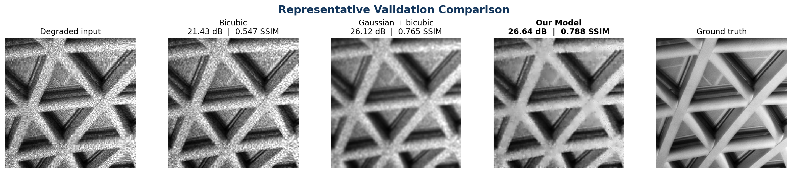

# Semiconductor Image Restoration — KLA Track

Compact, reproducible restoration of degraded grayscale inspection images for
the **SEMICON India Hackathon 2026 — KLA AI-Based Restoration of Degraded
Images challenge**. The submitted model removes mixed Gaussian/speckle noise
and performs 2× super-resolution in one forward pass.

## Submission contents

| Hackathon requirement | Repository location | How to verify |
|---|---|---|
| **1. README and setup instructions** | [`README.md`](README.md) | Follow [Quick inference from a fresh clone](#quick-inference-from-a-fresh-clone). |
| **2. Standalone evaluation script** | [`inference.py`](inference.py) | Accepts `--input-dir` and `--output-dir`, loads the submitted weights automatically, and needs no source edits or ground truth. |
| **3. Training script** | [`train.py`](train.py) | Reproduces paired training from scratch; commands are in [Training reproduction](#training-reproduction). |
| **4. Trained model weights** | [`weights/final.pt`](weights/final.pt) | Compact 2.3 MB inference checkpoint; SHA-256 is recorded below. |
| **5. Restored test outputs** | [`outputs/restored/`](outputs/restored/) | Contains 400 restored float32 `.npy` files with the original test filenames. |
| **6. Complete environment freeze** | [`requirements.txt`](requirements.txt) | Complete 221-entry `pip freeze` from the training container. Portable direct dependencies are in [`requirements.runtime.txt`](requirements.runtime.txt). |

> **Official evaluator entry point:** `inference.py`

## Quick inference from a fresh clone

### Option A — Python environment

```bash
git clone https://github.com/aryankalra404/Semicon_KLA.git
cd Semicon_KLA

python3 -m venv .venv
source .venv/bin/activate
python -m pip install --upgrade pip
python -m pip install -r requirements.runtime.txt

python inference.py \
  --input-dir /path/to/test/NoisyLR \
  --output-dir /path/to/restored
```

No manual edits are required. `inference.py` resolves the repository-relative
checkpoint `weights/final.pt` automatically. The default `--device auto` uses
CUDA when available and otherwise uses CPU.

### Option B — Reproducible NVIDIA Docker environment

```bash
git clone https://github.com/aryankalra404/Semicon_KLA.git
cd Semicon_KLA

docker build -t kla-restorenet .
mkdir -p outputs/evaluator

docker run --rm --gpus all \
  --ipc=host \
  --ulimit memlock=-1 \
  --ulimit stack=67108864 \
  -v "/absolute/path/to/test/NoisyLR":/inputs:ro \
  -v "$PWD/outputs/evaluator":/outputs \
  kla-restorenet \
  python inference.py \
    --input-dir /inputs \
    --output-dir /outputs \
    --device cuda \
    --batch-size 8
```

The Docker image is pinned to `nvcr.io/nvidia/pytorch:26.07-py3`. The precise
image digest and reference environment are documented in
[`ENVIRONMENT.md`](ENVIRONMENT.md).

## Evaluator contract

```text
python inference.py --input-dir INPUT_DIRECTORY --output-dir OUTPUT_DIRECTORY
```

- **Input:** a flat directory of grayscale `.npy` arrays. Both `128×128` and
  `256×256` inputs are accepted, including mixed-size directories.
- **Output:** one `.npy` file per input, retaining the original filename.
- **Resolution:** exactly 2× the input dimensions (`128→256` or `256→512`).
- **Format:** `float32`, finite values in `[0,1]`.
- **Model loading:** `weights/final.pt` is used by default.
- **Ground truth:** not required.
- **Batching:** inputs are grouped by shape and processed efficiently.

The complete command-line interface is available with:

```bash
python inference.py --help
```

## Fresh-clone verification

The public repository was cloned into a new temporary directory, built without
local project state, and run on the full 400-image blind input directory. The
rehearsal completed successfully:

```text
restored=400 device=cuda models=1 self_ensemble=x1
milliseconds_per_image=12.061 output_dir=/outputs
```

The committed output set was audited as follows:

| Property | Verified value |
|---|---:|
| File count | 400 |
| Filenames | `000000.npy`–`000399.npy` |
| Shape | `256×256` |
| Data type | `float32` |
| Non-finite values | 0 |
| Values outside `[0,1]` | 0 |
| Output aggregate SHA-256 | `8d73c8edf48b4490f817283172b625a7a17e0d16463096996227007fc70b195c` |
| `weights/final.pt` SHA-256 | `c1e67ad4400b1c899ef30a2bb6748a086c036661fef41932fbef548e5998bacd` |

To repeat the repository checks when official inputs are available locally:

```bash
python validate_submission.py --device auto
python make_output_manifest.py
python submission_audit.py
```

## Measured results

Metrics use a fixed, untouched 320-image paired validation partition. The 400
blind test inputs have no public ground truth and were never used to calculate
quality scores.

| Method | PSNR ↑ | SSIM ↑ | LPIPS ↓ | RTX A4000 latency ↓ |
|---|---:|---:|---:|---:|
| Bicubic | 22.8192 dB | 0.5460 | — | 0.10 ms/image* |
| Gaussian denoise + bicubic | 25.5339 dB | 0.6483 | — | classical diagnostic |
| Frozen v2 checkpoint | 26.2962 dB | **0.7004** | 0.3738 | 11.35 ms/image |
| **Submitted fine-tuned v2** | **26.3273 dB** | **0.7004** | **0.3717** | **11.34 ms/image** |

`*` Bicubic latency was measured on CPU and is not directly hardware-comparable.
Submitted-model latency is warmed batch-1 p50 on an NVIDIA RTX A4000; p95 is
11.45 ms/image. The model has **580,609 parameters** and uses approximately
**35.7 MiB peak allocated VRAM** in the benchmark.

Relative to bicubic, the submitted model improves mean validation quality by
**+3.5082 dB PSNR** and **+0.1543 SSIM**. Relative to the stronger Gaussian
denoise + bicubic baseline, it improves PSNR by **+0.7934 dB** and SSIM by
**+0.0521**, winning on 296/320 and 297/320 validation images respectively.



Full confidence intervals, paired tests, stress results, and failure analysis
are reported in [`results/README.md`](results/README.md).

## Method

The submission uses a compact residual restoration network designed around the
challenge's accuracy–latency trade-off:

```text
NoisyLR grayscale array
        │
        ▼
3×3 convolutional feature stem
        │
        ▼
12 residual restoration blocks (48 channels)
        │
        ├──────── global residual connection ────────┐
        ▼                                             │
3×3 convolution → 4-channel sub-pixel representation │
        │                                             │
        ▼                                             │
PixelShuffle ×2 ◄─────────────────────────────────────┘
        │
        ▼
Clamp to [0,1] → restored full-resolution output
```

Training uses paired NoisyLR/GT arrays and a composite objective:

```text
0.7 × robust pixel loss + 0.2 × SSIM loss + 0.1 × edge loss
```

The raw degraded input is not clipped before the network, preserving meaningful
out-of-range measurements produced by speckle noise. Synthetic augmentation
adds mixed Gaussian noise, multiplicative speckle noise, blur, downsampling,
and radiometric changes. EMA weights, gradient clipping, deterministic splits,
data auditing, and fail-closed candidate promotion provide training hygiene.

## Training reproduction

### Expected dataset layout

```text
data/train/
├── GT/
│   ├── 000000.npy
│   └── ...
└── NoisyLR/
    ├── 000000.npy
    └── ...
```

Ground-truth and degraded training arrays must have matching filenames. Raw
challenge data is intentionally excluded from Git.

Audit the pairs before training:

```bash
python audit_data.py
```

### Stage 1 — train v2 from scratch

```bash
python train.py \
  --data-root data/train \
  --variant v2 \
  --epochs 30 \
  --batch-size 8 \
  --workers 4 \
  --width 48 \
  --blocks 12 \
  --learning-rate 1e-4 \
  --synthetic-probability 0.2 \
  --synthetic-policy fixed \
  --ema-decay 0.999 \
  --gradient-clip 1.0 \
  --seed 2026 \
  --device cuda \
  --output-dir weights/v2
```

This experiment ran for 30 epochs. The best balanced base checkpoint was
selected at **epoch 24**, rather than using the final epoch. Selection score:
`PSNR + 10 × SSIM`.

### Stage 2 — controlled low-learning-rate fine-tune

```bash
python train.py \
  --data-root data/train \
  --variant v2 \
  --initialize-from weights/v2/best_balanced.pt \
  --epochs 5 \
  --batch-size 8 \
  --workers 4 \
  --width 48 \
  --blocks 12 \
  --learning-rate 5e-5 \
  --synthetic-probability 0.2 \
  --synthetic-policy fixed \
  --ema-decay 0.995 \
  --gradient-clip 1.0 \
  --seed 2026 \
  --device cuda \
  --output-dir weights/v2_finetune
```

The fine-tuning experiment evaluated every epoch. **Fine-tuning epoch 1** had
the best validation selection score and became the submitted checkpoint. This
does not mean the network was trained from random initialization for one epoch:
it was initialized from the fully trained v2 base. Continuing for more epochs
did not improve the selection score.

Export a compact inference-only checkpoint with:

```bash
python export_checkpoint.py \
  --input weights/v2_finetune/best_balanced.pt \
  --output weights/final.pt
```

Training creates `best_psnr.pt`, `best_ssim.pt`, `best_balanced.pt`, `last.pt`,
and `history.json`. Interrupted runs can resume with `--resume PATH_TO_LAST_PT`.

## Evaluation and benchmarking

Evaluate a checkpoint on paired data:

```bash
python evaluate.py \
  --method model \
  --split val \
  --input-dir data/train/NoisyLR \
  --gt-dir data/train/GT \
  --weights weights/final.pt \
  --device cuda \
  --lpips \
  --json-output outputs/model_metrics.json
```

Measure warmed batch-1 latency, tail latency, parameters, and peak GPU memory:

```bash
python benchmark.py \
  --weights weights/final.pt \
  --batch-size 1 \
  --device cuda \
  --json-output outputs/final_benchmark.json
```

Run the automated tests:

```bash
python -m unittest discover -s tests -v
```

## Robustness evidence and honest boundaries

The repository includes deterministic stress evaluation, degradation-order
experiments, appearance-cluster OOD proxies, defect-preservation probes, and
geometric disagreement maps. Experimental challengers are isolated from the
submitted checkpoint and can replace it only if every promotion gate passes.

- The official validation split measures paired restoration quality.
- The appearance-cluster split is an **OOD proxy**, not a claim about private
  KLA source identities.
- Synthetic defect probes test localized response preservation but are not
  labeled production defects.
- The `256→512` execution contract is tested for shape, range, speed, and
  memory; reported paired PSNR/SSIM/LPIPS correspond to the evaluated paired
  validation resolution.
- The known failure mode is over-smoothing stochastic high-frequency texture
  whose discarded detail cannot be uniquely reconstructed.

Useful evidence:

- [`results/README.md`](results/README.md) — complete measured results
- [`figures/presentation_representative_detailed.png`](figures/presentation_representative_detailed.png) — representative result with detail crops
- [`figures/limitation_oversmoothing_002994.png`](figures/limitation_oversmoothing_002994.png) — retained failure case
- [`REFERENCES.md`](REFERENCES.md) — research and implementation references
- [`ENVIRONMENT.md`](ENVIRONMENT.md) — exact container and hardware metadata

## Repository structure

```text
Semicon_KLA/
├── inference.py              # official standalone evaluator entry point
├── train.py                  # paired training and fine-tuning
├── evaluate.py               # PSNR, SSIM and optional LPIPS evaluation
├── benchmark.py              # latency, VRAM and parameter benchmarking
├── validate_submission.py    # end-to-end inference contract test
├── kla_restore/              # model, data, loss, metric and runtime modules
├── weights/final.pt          # submitted inference checkpoint
├── outputs/restored/         # 400 committed blind-test restorations
├── requirements.txt          # complete training-container pip freeze
├── requirements.runtime.txt  # portable direct dependencies
├── Dockerfile                # pinned reproducible evaluator image
├── results/                  # metrics and statistical evidence
└── figures/                  # result and failure-analysis figures
```

## License and references

Repository-authored code is released under [`LICENSE`](LICENSE). The NVIDIA NGC
base image and third-party packages retain their respective licenses. Research
papers, metrics, and implementation sources are listed in
[`REFERENCES.md`](REFERENCES.md).
