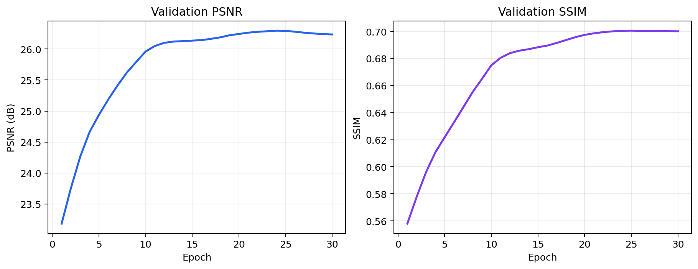

# Semicon KLA Image Restoration

Reproducible AI restoration pipeline for the **SEMICON India Hackathon 2026
KLA challenge**. It maps noisy grayscale NumPy arrays to clean outputs at twice
their spatial resolution (`128x128` to `256x256` and `256x256` to `512x512`)
while preserving fine semiconductor structures.

## Results

On the fixed 320-image validation split, the compact 580,609-parameter final
model achieves **26.3273 dB PSNR**, **0.7004 SSIM**, **0.3717 LPIPS**, and
**11.34 ms/image batch-1 p50 latency** on an NVIDIA RTX A4000. Relative to
bicubic, its mean gains are +3.5082 dB PSNR and +0.1543 SSIM. Full metrics, confidence
intervals, and failure analysis are in
[`results/`](results/README.md).



## Dataset

Place the official extracted release in this layout:

```text
data/train/GT/          # 000000.npy ... 003199.npy
data/train/NoisyLR/     # paired training degradations
data/test/NoisyLR/      # 000000.npy ... 000399.npy blind degradations
```

The blind test archive restarts its numbering at zero; its filenames do not map
to equally numbered training targets. Training uses paired IDs 0-2879 and
validation uses 2880-3199. The raw data is intentionally excluded from Git.

## Environment

Python 3.10-3.12 is recommended for CUDA environments.

```bash
python -m venv .venv
source .venv/bin/activate
pip install -r requirements.txt
```

For the exact NGC image, CUDA/container metadata and clean Docker command, see
[`ENVIRONMENT.md`](ENVIRONMENT.md).

The bounded GPU experiment runner is `run_gpu_matrix.sh`; it builds the local
`kla-restorenet:latest` image from the pinned NVIDIA NGC base image on first
use. It deliberately separates challenger training from promotion so an
experiment cannot silently replace the frozen submission checkpoint.

## Verify the project

```bash
python -m unittest discover -s tests -v
python audit_data.py
```

## Bicubic baseline

```bash
python evaluate.py \
  --method bicubic \
  --split val \
  --input-dir data/train/NoisyLR \
  --gt-dir data/train/GT \
  --json-output outputs/bicubic_metrics.json
```

## Train

Run a one-epoch smoke test before committing GPU time:

```bash
python train.py --epochs 1 --batch-size 4 --workers 0 --width 16 --blocks 2 \
  --limit-train 16 --limit-val 8 --output-dir weights/smoke
```

Full starting configuration:

```bash
python train.py --epochs 30 --batch-size 8 --width 48 --blocks 12 \
  --synthetic-probability 0.2 --output-dir weights/v2
```

The trainer uses exponential moving-average weights and writes separate
`best_psnr.pt`, `best_ssim.pt`, and `best_balanced.pt` checkpoints. The balanced
score is `PSNR + 10*SSIM`.
Interrupted runs can resume without discarding optimizer state:

```bash
python train.py --epochs 50 --batch-size 8 --width 48 --blocks 12 \
  --resume weights/last.pt
```

## Degradation-aware v3 experiment

The optional v3 architecture keeps the validated v2 restoration trunk, then
adds a small implicit degradation encoder and two high-resolution refinement
blocks. Its synthetic branch independently gates and randomizes the order of
blur/downsampling, Gaussian noise, speckle noise, and radiometric changes. A
low-frequency data-consistency term encourages faithful LR structure without
forcing the prediction to reproduce pixel-level noise.

First measure the official paired-data distribution:

```bash
python analyze_degradations.py --split all
```

Run a short, warm-started GPU pilot from the committed v2 checkpoint:

```bash
python train.py \
  --variant v3 \
  --initialize-from weights/final.pt \
  --epochs 5 \
  --batch-size 8 \
  --workers 4 \
  --width 48 \
  --blocks 12 \
  --condition-dim 32 \
  --hr-width 48 \
  --hr-blocks 2 \
  --learning-rate 5e-5 \
  --synthetic-probability 0.25 \
  --synthetic-policy randomized \
  --consistency-weight 0.03 \
  --device cuda \
  --output-dir weights/v3_pilot
```

`--initialize-from` performs an exact architectural transfer: before the first
optimization step, v3 produces the same output as v2. It fails fast if the
width, block count, or HR feature width prevents complete transfer.

Evaluate the pilot on the untouched official validation split and deterministic
stress suite:

```bash
python evaluate.py --method model --split val \
  --input-dir data/train/NoisyLR --gt-dir data/train/GT \
  --weights weights/v3_pilot/best_balanced.pt --device cuda \
  --lpips --per-image-output outputs/v3_pilot_per_image.csv \
  --json-output outputs/v3_pilot_metrics.json

python evaluate_stress.py \
  --weights weights/final.pt --device cuda \
  --json-output outputs/v2_stress.json
python evaluate_stress.py \
  --weights weights/v3_pilot/best_balanced.pt --device cuda \
  --json-output outputs/v3_pilot_stress.json
```

Only promote v3 if it improves both official validation metrics, or materially
improves LPIPS/stress robustness while losing no more than `0.10 dB` PSNR and
`0.002` SSIM. The committed v2 checkpoint remains the fallback.

## Range-aware v4a experiment

The isolated v4a experiment targets a KLA-specific observation: speckle noise
can push NoisyLR intensities beyond the nominal ground-truth range. Its stem
receives four deterministic channels: raw intensity, clipped intensity,
positive overflow, and negative overflow. Raw measurements remain untouched.

v4a otherwise preserves the compact v2 stem, trunk, and upsampler. Warm-starting
copies the complete v2 model unchanged and initializes a separate three-channel
auxiliary stem to zero, so the first prediction is exactly identical to v2.

```bash
./run_gpu_matrix.sh v4a-pilot
./run_gpu_matrix.sh v4a-evaluate
```

The five-epoch pilot is a controlled architecture ablation: it uses the same
split, loss, synthetic policy, and seed as v2, with a lower fine-tuning learning
rate. It remains experimental until official validation, LPIPS, stress metrics,
and batch-1 latency justify promotion.

To separate the effect of extra fine-tuning from the range-aware representation,
run the matched ablation. It retrains ordinary v2 and v4a from the same frozen
checkpoint with an independently seeded, identical DataLoader order; then it
evaluates frozen v2, the matched v2 control, and v4a with paired bootstrap
confidence intervals and exact sign tests.

```bash
./run_gpu_matrix.sh v4a-ablation
```

## Multi-scale frequency v4b experiment

v4b tests whether explicitly separating image-frequency evidence improves the
validated compact v2 trunk. A lightweight auxiliary branch receives the raw
NoisyLR observation, two local high-pass residuals, a coarse low-pass view, and
pooled trunk context. It predicts an LR feature correction before the existing
PixelShuffle upsampler. The correction projection starts at exactly zero, so a
v2 warm start gives bit-identical predictions before optimization.

Run the matched experiment on the NVIDIA host:

```bash
./run_gpu_matrix.sh v4b-ablation
```

This trains an ordinary v2 control and v4b for five epochs from the same
checkpoint with identical split, seed, DataLoader order, augmentation, loss,
and learning rate. It then measures official validation PSNR/SSIM/LPIPS,
six-scenario stress robustness, batch-1 latency/VRAM, and paired bootstrap and
sign-test evidence. v4b is experimental and never replaces `weights/final.pt`
unless it beats its matched control under the documented promotion gate.

The first staged pilot was rejected after its branch-only learning rate caused
rapid validation collapse. Its checkpoints are not candidates. The corrected
`v4b-v2` protocol starts in a fresh directory, freezes inherited v2 parameters
for only two epochs at a `5e-6` branch learning rate, then unfreezes the network
at `2e-6`/`5e-6` backbone/branch rates. A frozen v2 teacher adds a small output
preservation loss, and the run aborts automatically if validation PSNR falls
more than 0.10 dB below the reference. A filesystem lock refuses duplicate
launches. The command evaluates the protected final v2 and challenger and never
promotes automatically:

```bash
./run_gpu_matrix.sh v4b-v2
```

The challenger must meet the same PSNR/SSIM/LPIPS, stress, latency, and paired
statistical gates before `weights/final.pt` can be changed.

## Evaluate a trained checkpoint

```bash
python evaluate.py \
  --method model \
  --split val \
  --weights weights/final.pt \
  --input-dir data/train/NoisyLR \
  --gt-dir data/train/GT \
  --json-output outputs/model_metrics.json
```

Add `--lpips --per-image-output outputs/v2_per_image.csv` to compute the
perceptual metric and save case-level results when the optional LPIPS dependency
is installed.

## Standalone inference

This is the competition-facing command. Ground truth is not required.

```bash
python inference.py \
  --input-dir /path/to/NoisyLR \
  --output-dir /path/to/restored
```

Outputs retain the original filenames and are saved as float32 `.npy` arrays in
`[0, 1]` at exactly twice each input's height and width. Mixed 128x128 and
256x256 input directories are grouped by shape automatically for efficient
batched inference.

Optional accuracy experiments use the same evaluator contract:

```bash
# Geometric test-time self-ensemble
python inference.py --input-dir /path/to/NoisyLR --output-dir /path/to/restored \
  --self-ensemble x4

# Output-average multiple compatible checkpoints
python inference.py --input-dir /path/to/NoisyLR --output-dir /path/to/restored \
  --weights weights/model_a.pt weights/model_b.pt
```

The default remains the fastest single-checkpoint `x1` path. Accuracy modes are
promoted only when their measured gain justifies additional H100 inference.

The repository includes the compact inference-only `weights/final.pt` model.
It contains no optimizer state and loads with the same standalone inference
command used by the benchmark team.

## Submission audit

With official test inputs present locally, this command checks the committed
checkpoint hash and parameter count, runs standalone inference in a subprocess,
and validates output filenames, shapes, dtype, finiteness, and range:

```bash
python validate_submission.py --device auto
python make_output_manifest.py
python submission_audit.py
```

For a reproducible NVIDIA environment:

```bash
docker build -t kla-restorenet .
docker run --rm --gpus all \
  -v "$PWD/data":/workspace/project/data:ro \
  kla-restorenet python validate_submission.py --device cuda
```

For warmed batch-1 latency, tail latency, parameter count, and peak CUDA memory:

```bash
python benchmark.py --weights weights/final.pt --batch-size 1 --device cuda \
  --json-output outputs/final_benchmark.json
```
