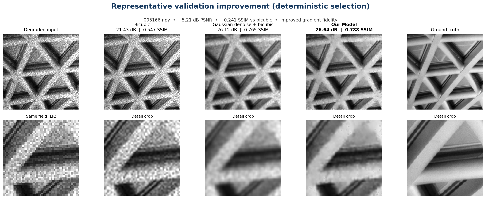

# Semiconductor Image Restoration for the KLA Track

An efficient PyTorch model for restoring degraded grayscale inspection images.
The network removes mixed Gaussian and speckle noise while performing 2x
super-resolution in a single forward pass.

Developed for the **SEMICON India Hackathon 2026, KLA AI-Based Restoration of
Degraded Images challenge**.

## Results at a glance

Evaluation was performed on a fixed 320-image paired validation split. The
submitted checkpoint was selected using validation data only. The 400 provided
test inputs have no public ground truth and were not used to calculate these
quality metrics.

| Model | PSNR | SSIM | LPIPS | Latency |
|---|---:|---:|---:|---:|
| Bicubic interpolation | 22.8192 dB | 0.5460 | N/A | 0.10 ms/image on CPU |
| Gaussian denoising with bicubic interpolation | 25.5339 dB | 0.6483 | N/A | Diagnostic baseline |
| Base restoration model | 26.2962 dB | **0.7004** | 0.3738 | 11.35 ms/image |
| **Submitted model** | **26.3273 dB** | **0.7004** | **0.3717** | **11.34 ms/image** |

The submitted model contains **580,609 parameters** and used approximately
**35.7 MiB of peak allocated VRAM** during benchmarking. Its warmed batch-size
1 latency on an NVIDIA RTX A4000 was 11.34 ms at p50 and 11.45 ms at p95.

Compared with bicubic interpolation, it improves mean validation quality by
3.5082 dB PSNR and 0.1543 SSIM. Compared with Gaussian denoising followed by
bicubic interpolation, it improves PSNR by 0.7934 dB and SSIM by 0.0521.



This is a representative validation example selected with a deterministic
procedure. Aggregate results, confidence intervals, paired tests, stress tests,
and failure analysis are available in [results/README.md](results/README.md).

## Repository contents

| File or directory | Purpose |
|---|---|
| [`inference.py`](inference.py) | Standalone evaluation script that accepts input and output directory paths |
| [`train.py`](train.py) | Paired training and fine-tuning script |
| [`weights/final.pt`](weights/final.pt) | Final 2.3 MB inference checkpoint |
| [`outputs/restored/`](outputs/restored/) | 400 restored test arrays with original filenames |
| [`requirements.txt`](requirements.txt) | Complete package freeze from the training container |
| [`requirements.runtime.txt`](requirements.runtime.txt) | Minimal portable inference dependencies |
| [`Dockerfile`](Dockerfile) | Reproducible NVIDIA evaluation environment |

`requirements.runtime.txt` is the portable evaluator environment used by the
setup commands below. `requirements.txt` is the complete package freeze from
the pinned NVIDIA training container and contains container-local wheel paths;
reproduce that environment through the Dockerfile rather than installing the
full freeze on an arbitrary host.

## Setup and inference

### Python environment

```bash
git clone https://github.com/aryankalra404/Semicon_KLA.git
cd Semicon_KLA

python3 -m venv .venv
source .venv/bin/activate
python -m pip install --upgrade pip
python -m pip install -r requirements.runtime.txt

python inference.py \
  --input-dir /path/to/test/NoisyLR \
  --output-dir /path/to/restored
```

No source edits are required. The script loads `weights/final.pt` by default.
Device selection is automatic: CUDA is used when available, otherwise
inference runs on CPU.

### NVIDIA Docker

```bash
git clone https://github.com/aryankalra404/Semicon_KLA.git
cd Semicon_KLA

docker build -t our-model .
mkdir -p outputs/evaluator

docker run --rm --gpus all \
  --ipc=host \
  --ulimit memlock=-1 \
  --ulimit stack=67108864 \
  -v "/absolute/path/to/test/NoisyLR":/inputs:ro \
  -v "$PWD/outputs/evaluator":/outputs \
  our-model \
  python inference.py \
    --input-dir /inputs \
    --output-dir /outputs \
    --device cuda \
    --batch-size 8
```

The container uses `nvcr.io/nvidia/pytorch:26.07-py3`. The image digest,
software versions, and hardware details are recorded in
[ENVIRONMENT.md](ENVIRONMENT.md).

### Inference interface

```text
python inference.py --input-dir INPUT_DIRECTORY --output-dir OUTPUT_DIRECTORY
```

The evaluator:

- reads a flat directory of grayscale `.npy` arrays;
- accepts `128x128` and `256x256` inputs, including mixed-size directories;
- writes one restored `.npy` array for every input using the same filename;
- produces an output with twice the input height and width;
- saves finite `float32` values in the `[0,1]` range;
- groups inputs by shape for efficient batching;
- does not require ground-truth images.

Run `python inference.py --help` to view all command-line options.

## Approach

The model is a compact residual convolutional network designed for restoration
quality and low inference cost.

```text
Degraded grayscale image
          |
          v
3x3 convolutional feature stem
          |
          v
12 residual restoration blocks, 48 channels
          |                              Degraded input
          v                                    |
3x3 convolution to four sub-pixel channels     |
          |                                    v
          v                              Bicubic upsample
PixelShuffle 2x                               |
          |                                    |
          +-------------- add -----------------+
                         |
                         v
          Restored full-resolution image in [0,1]
```

The raw degraded array is passed to the network without clipping. This retains
out-of-range intensities introduced by speckle noise. The final output is
clamped to the valid ground-truth range.

Training uses paired NoisyLR and ground-truth arrays with the following loss:

```text
0.7 * robust pixel loss + 0.2 * SSIM loss + 0.1 * edge loss
```

The pixel term promotes accurate intensity recovery, the SSIM term preserves
local structure, and the edge term discourages excessive smoothing. Training
also uses exponential moving average weights, gradient clipping, deterministic
splits, and data integrity checks.

Synthetic augmentation combines:

- additive Gaussian noise;
- multiplicative speckle noise;
- Gaussian blur;
- spatial downsampling;
- radiometric variation.

These transformations supplement the paired challenge data and expose the
network to mixed degradation conditions.

## Training

### Dataset layout

```text
data/train/
|-- GT/
|   |-- 000000.npy
|   `-- ...
`-- NoisyLR/
    |-- 000000.npy
    `-- ...
```

Files in `GT` and `NoisyLR` must use matching names. Raw challenge data is not
included in the repository.

Audit all pairs before training:

```bash
python audit_data.py
```

### Base training

```bash
python train.py \
  --data-root data/train \
  --variant v2 \
  --epochs 30 \
  --batch-size 8 \
  --workers 4 \
  --width 48 \
  --blocks 12 \
  --learning-rate 1e-4 \
  --synthetic-probability 0.2 \
  --synthetic-policy fixed \
  --ema-decay 0.999 \
  --gradient-clip 1.0 \
  --seed 2026 \
  --device cuda \
  --output-dir weights/v2
```

The base experiment ran for 30 epochs. The checkpoint from epoch 24 achieved
the strongest balanced validation score and was retained for fine-tuning.

### Controlled fine-tuning

```bash
python train.py \
  --data-root data/train \
  --variant v2 \
  --initialize-from weights/v2/best_balanced.pt \
  --epochs 5 \
  --batch-size 8 \
  --workers 4 \
  --width 48 \
  --blocks 12 \
  --learning-rate 5e-5 \
  --synthetic-probability 0.2 \
  --synthetic-policy fixed \
  --ema-decay 0.995 \
  --gradient-clip 1.0 \
  --seed 2026 \
  --device cuda \
  --output-dir weights/v2_finetune
```

Each fine-tuning epoch was evaluated separately. Epoch 1 produced the best
validation score and became the submitted checkpoint. It was initialized from
the fully trained base model; it was not trained from random initialization for
one epoch. Additional fine-tuning epochs did not improve model selection.

Export the selected model as a compact inference checkpoint:

```bash
python export_checkpoint.py \
  --input weights/v2_finetune/best_balanced.pt \
  --output weights/final.pt
```

Training writes `best_psnr.pt`, `best_ssim.pt`, `best_balanced.pt`, `last.pt`,
and `history.json`. An interrupted run can resume with `--resume CHECKPOINT`.

### Training curves


The curves show rapid early improvement followed by convergence. Checkpoint
selection used measured validation quality rather than the final epoch.

## Evaluation and benchmarking

Evaluate PSNR, SSIM, and LPIPS on paired data:

```bash
python evaluate.py \
  --method model \
  --split val \
  --input-dir data/train/NoisyLR \
  --gt-dir data/train/GT \
  --weights weights/final.pt \
  --device cuda \
  --lpips \
  --json-output outputs/model_metrics.json
```

Measure warmed latency, tail latency, parameter count, and peak GPU memory:

```bash
python benchmark.py \
  --weights weights/final.pt \
  --batch-size 1 \
  --device cuda \
  --json-output outputs/final_benchmark.json
```

Run the automated tests:

```bash
python -m unittest discover -s tests -v
```

## Reproducibility checks

The repository was cloned into a clean temporary directory, built as a new
Docker image, and run on all 400 test inputs. The clean-clone rehearsal
completed successfully:

```text
restored=400 device=cuda models=1 self_ensemble=x1
milliseconds_per_image=12.061 output_dir=/outputs
```

The committed submission artifacts were audited with the following results:

| Property | Verified value |
|---|---:|
| Restored files | 400 |
| Filename range | `000000.npy` to `000399.npy` |
| Output shape | `256x256` |
| Data type | `float32` |
| Non-finite values | 0 |
| Values outside `[0,1]` | 0 |
| Output aggregate SHA-256 | `8d73c8edf48b4490f817283172b625a7a17e0d16463096996227007fc70b195c` |
| Checkpoint SHA-256 | `c1e67ad4400b1c899ef30a2bb6748a086c036661fef41932fbef548e5998bacd` |

Repeat the submission checks with:

```bash
python validate_submission.py --device auto
python make_output_manifest.py
python submission_audit.py
```

## Robustness and limitations

The repository includes deterministic stress tests, degradation-order tests,
an appearance-cluster OOD proxy, localized defect-preservation probes, and
geometric disagreement maps. Experimental checkpoints are kept separate from
the submitted model and are promoted only when all predefined quality and
latency checks pass.

The appearance-cluster experiment is an OOD proxy and is not presented as a
measurement of private KLA source identities. Synthetic defect probes measure
localized response preservation but do not represent labeled production
defects. The known failure mode is smoothing of stochastic high-frequency
texture when the discarded detail cannot be uniquely reconstructed.

Detailed evidence is available in:

- [results/README.md](results/README.md), complete metrics and statistical tests;
- [presentation_representative_detailed.png](figures/presentation_representative_detailed.png), detail-crop comparison;
- [limitation_oversmoothing_002994.png](figures/limitation_oversmoothing_002994.png), documented failure case;
- [REFERENCES.md](REFERENCES.md), research and implementation references;
- [ENVIRONMENT.md](ENVIRONMENT.md), container and hardware metadata.

## Project structure

```text
Semicon_KLA/
|-- inference.py
|-- train.py
|-- evaluate.py
|-- benchmark.py
|-- validate_submission.py
|-- kla_restore/
|-- weights/final.pt
|-- outputs/restored/
|-- requirements.txt
|-- requirements.runtime.txt
|-- Dockerfile
|-- results/
`-- figures/
```

## License and references

Repository-authored code is released under [LICENSE](LICENSE). The NVIDIA NGC
base image and third-party packages retain their respective licenses. Research
papers, metrics, and implementation sources are listed in
[REFERENCES.md](REFERENCES.md).
